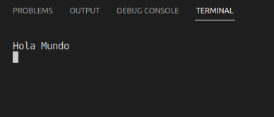
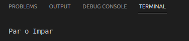
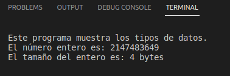
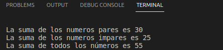
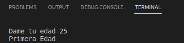

# U1  

<e1>
<li>01Hola_Mundo</li>
<li>02ParImpar</li>
<li>03TiposDatos</li>
<li>04Ciclos</li>
<li>05Edades</li>
</e>

<h2>01Hola_Mundo </h2>

___
Este código muestra el mensaje "Hola Mundo".
[Hola Mundo](https://github.com/UP210586/UP210586_CPP/blob/master/U1/01Hola_Mundo.cpp)

<h2>02_ParImpar </h2>

___
Este código muestra el mensaje "Par o impar".
[ParImpar](https://github.com/UP210586/UP210586_CPP/blob/master/U1/02ParImpar.cpp)  

<h2>03_TiposdeDatos </h2>

___
Muestra los diferentes tipos de datos en C++.
[Tipos de datos](https://github.com/UP210586/UP210586_CPP/blob/master/U1/03TiposdeDatos.cpp)  

<h2>04_Ciclos </h2>

___
Muestra suma de pares e impares.  
[Ciclos](https://github.com/UP210586/UP210586_CPP/blob/master/U1/04Ciclos.cpp)

<h2>05_Edades </h2>

___
Define la etapa de la persona  
[Edades](https://github.com/UP210586/UP210586_CPP/blob/master/U1/05Edades.cpp)  

