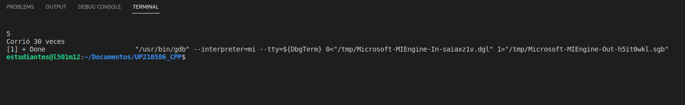
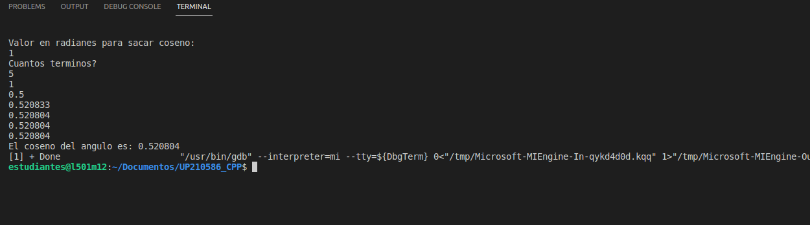
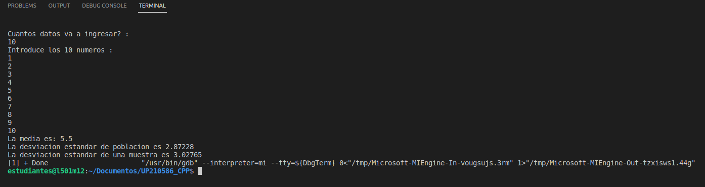
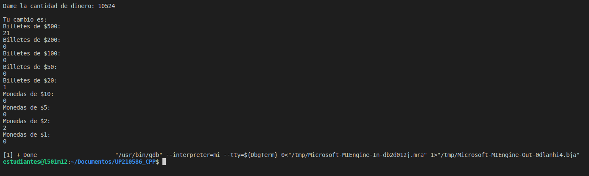
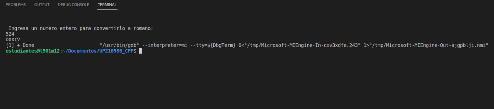
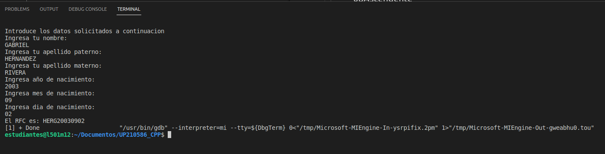
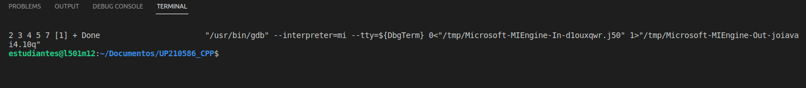
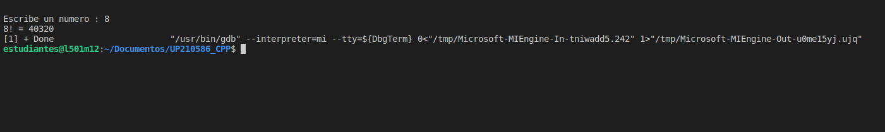

# U3 

<li>01Biseccion</li>
<li>02Bisiesto</li> 
<li>03Coseno</li>
<li>04DesviacionStd</li>
<li>05Moneda</li> 
<li>06ArabigosRom</li> 
<li>07RFC</li>
<li>08Ascendente</li>
<li>09Recursiva</li>
</e>  

  
<h2>01Biseccion </h2>

___    
[Biseccion](https://github.com/UP210586/UP210586_CPP/blob/master/U3/01Biseccion.cpp)   
   

<h2>02Bisiesto </h2>

___    
[Bisiesto](https://github.com/UP210586/UP210586_CPP/blob/master/U3/02Bisiesto.cpp)  
 

<h2>03Coseno </h2>

___    
[Coseno](https://github.com/UP210586/UP210586_CPP/blob/master/U3/03Coseno.cpp)  
  

<h2>04DesviacionStd </h2>

___    
[DesviacionStd](https://github.com/UP210586/UP210586_CPP/blob/master/U3/04DesviacionStd.cpp)  
  

<h2>05Moneda </h2>

___    
[Moneda](https://github.com/UP210586/UP210586_CPP/blob/master/U3/05Moneda.cpp)  

<h2>06ArabigosRom </h2>

___    
[ArabigosRom](https://github.com/UP210586/UP210586_CPP/blob/master/U3/06ArabigosRom.cpp)  

<h2>07RFC </h2>

___    
[RFC](https://github.com/UP210586/UP210586_CPP/blob/master/U3/07RFC.cpp)  
  

<h2>08Ascendente </h2>

___    
[Ascendente](https://github.com/UP210586/UP210586_CPP/blob/master/U3/08Ascendente.cpp)  
  

<h2>09Recursiva </h2>

___    
[Recursiva](https://github.com/UP210586/UP210586_CPP/blob/master/U3/09Recursiva.cpp)  

